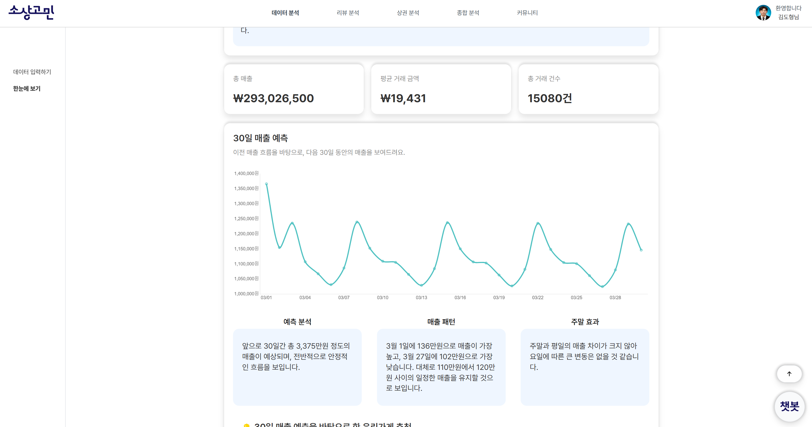
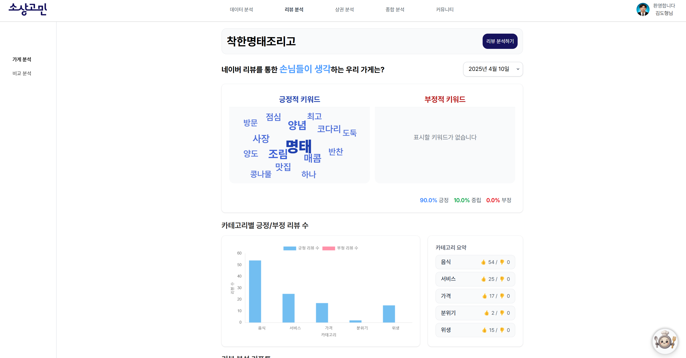
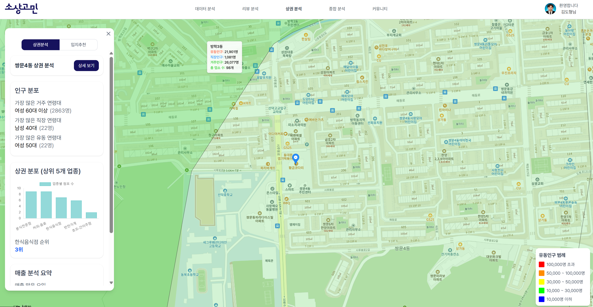
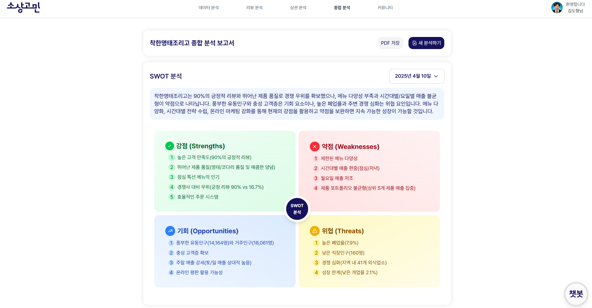
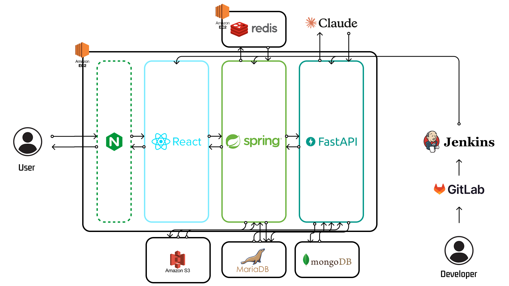

# 소상고민 (Sosangomin) 🍴

## 소상공인을 위한 데이터 분석 플랫폼

POS기 데이터를 이용한 데이터 분석 결과와 인사이트 제공 및 상권 분석, 내 가게 평판 분석을 통해 소상공인의 데이터 기반 의사결정을 지원합니다.

## 주요 기능

### 데이터 분석
- **데이터 자동 전처리**: 결측치 처리, 이상치 탐지, 데이터 타입 감지
- **탐색적 데이터 분석(EDA)**: 자동화된 분석 및 시각화
- **분석 결과 설명**: 이해하기 쉬운 설명 제공
- **시간 패턴 분석**
    - **시간대별 매출 패턴**: 하루 중 매출이 높은 시간대 분석
    - **요일별 매출 패턴**: 요일에 따른 매출 및 고객 방문 분석
    - **월별/계절별 트렌드**: 시간 흐름에 따른 매출 패턴 분석
    - **특정 기간 비교**: 이전 기간과의 매출 비교 분석
- **상품 분석**
    - **베스트셀러 상품**: 가장 잘 팔리는 상품 식별
    - **상품별 매출 기여도**: 각 상품이 전체 매출에 기여하는 비율
    - **상품 조합 분석**: 함께 판매되는 상품 패턴 파악
    - **상품 클러스터링**: 상품 특성별 그룹화 분석
- **AI 기반 예측 모델링**
    - **매출/판매량 예측**: 시계열 예측 모델을 활용한 향후 30일 매출 예측
    - **상품 세그멘테이션**: K-means 클러스터링을 이용한 상품 세분화
    - **실행 가능 인사이트**: 데이터에 기반한 구체적 비즈니스 제안

### 리뷰 분석
- **자동 리뷰 수집**: 네이버 플레이스 리뷰 자동 크롤링
- **감성 분석**: 긍정/부정/중립 리뷰 분류 및 트렌드 분석
- **키워드 분석**: 주요 키워드 추출 및 워드 클라우드 시각화
- **경쟁사 분석**
    - **경쟁사 리뷰 분석**: 경쟁사 리뷰 자동 수집 및 분석
    - **비교 분석**: 내 매장 vs 경쟁사 리뷰 비교
    - **차별화 전략 제안**: 경쟁우위 요소 식별 및 개선 필요 영역 제안

### 상권 분석
- **인구 통계 분석**: 지역별 인구 구성 및 유동인구 분석
- **상권 정보**: 동네별 상권 특성 및 경쟁 밀도 분석
- **입지 분석**: 최적 위치 제안 및 주변 시설 시너지 분석

### SWOT 종합 분석 보고서
- **자동 SWOT 분석**: 모든 데이터를 종합한 SWOT 매트릭스 생성
- **전략 제안**: SWOT 기반 사업 전략 및 실행 계획 제안
- **시각화 보고서**: 그래프와 차트를 활용한 직관적 데이터 시각화

### AI 채팅 상담 (RAG 시스템)
- **데이터 기반 상담**: 매장 데이터 기반 맞춤형 답변 제공
- **자연어 쿼리**: 일상 언어로 데이터 질문 가능 (예: "최근 3개월간 매출이 감소한 원인을 분석해줘")
- **경영 조언**: 매출 증대 방안 및 운영 최적화 조언 제공

## 프로젝트 개요

소상고민은 데이터 분석 전문 지식이 없는 소상공인도 쉽게 자신의 비즈니스 데이터를 분석하고 인사이트를 얻을 수 있도록 설계된 종합 데이터 분석 플랫폼입니다. 현대 비즈니스 환경에서 데이터 기반 의사결정은 필수적이지만, 소규모 사업자들은 기술적 지식 부족, 비용 문제, 시간 제약 등으로 데이터 분석의 혜택을 누리기 어렵습니다.

소상고민은 이러한 장벽을 낮추고, POS기에서 수집된 판매 데이터, 네이버 리뷰 데이터, 상권 정보 등을 자동으로 분석하여 직관적이고 실행 가능한 인사이트를 제공합니다. 복잡한 데이터 분석 과정을 자동화하고, AI 기술을 활용하여 쉬운 자연어로 질문하고 답변받을 수 있는 환경을 구축했습니다.

### 소상고민의 미션

1. **데이터 접근성 향상**: 기술적 지식 없이도 데이터의 가치를 활용할 수 있는 플랫폼 제공
2. **비즈니스 의사결정 지원**: 실질적인 비즈니스 개선으로 이어질 수 있는 실행 가능한 인사이트 제공
3. **소상공인 경쟁력 강화**: 빅데이터와 AI 기술을 소상공인에게 민주화하여 대기업과의 정보 격차 해소

### 해결하고자 하는 문제

소상고민은 다음과 같은 소상공인의 일반적인 문제를 해결하고자 합니다:

- **데이터 파편화**: 여러 소스(POS, 리뷰, 상권 정보 등)의 데이터가 분산되어 있어 통합적 분석이 어려움
- **전문 지식 부족**: 데이터 분석에 필요한 통계, 프로그래밍 지식이 없어 데이터 활용이 제한적
- **시간 제약**: 매일 가게 운영에 바쁜 소상공인이 데이터 분석에 할애할 시간 부족
- **비용 문제**: 전문 데이터 분석 서비스나 컨설팅은 소규모 사업자에게 비용 부담이 큼
- **실행 가능한 인사이트 부족**: 단순 데이터 시각화를 넘어 구체적인 행동 지침이 필요

### 소상고민의 해결법

소상고민은 다음과 같은 접근 방식으로 이러한 문제들을 해결합니다:

1. **통합 데이터 분석**: 판매 데이터, 리뷰, 상권 정보 등 다양한 데이터 소스를 하나의 플랫폼에서 통합 분석
2. **자동화된 인사이트 도출**: 복잡한 데이터 분석 과정을 자동화하여 소상공인이 즉시 인사이트를 얻을 수 있도록 지원
3. **자연어 인터페이스**: AI 기반 챗봇을 통해 일상 언어로 데이터에 대한 질문을 할 수 있는 접근성 제공
4. **실행 가능한 제안**: 단순 데이터 시각화를 넘어 구체적인 비즈니스 개선 방안 제시
5. **사용자 친화적 UI/UX**: 기술적 배경 없이도 쉽게 이해하고 사용할 수 있는 직관적인 인터페이스

소상고민은 단순한 데이터 분석 도구가 아닌, 소상공인이 비즈니스를 더 잘 이해하고 더 나은 결정을 내릴 수 있도록 돕는 종합적인 분석 서비스를 목표로 합니다.

## 소상고민의 차별점

### 코드 없는 데이터 분석
- 기술 지식이 없는 소상공인도 쉽게 사용 가능
- 직관적인 UI/UX로 복잡한 데이터 분석 프로세스 간소화

### 맞춤형 인사이트 제공
- 개인 가게에 특화된 분석 제공
- 데이터 기반의 실행 가능한 비즈니스 제안

### 통합 분석 솔루션
- 매출 분석, 리뷰 분석, 상권 분석 등 통합 제공
- 여러 데이터 소스를 하나의 플랫폼에서 연계 분석

### AI를 활용한 자연어 데이터 분석
- 데이터베이스 쿼리 언어 대신 일상 언어로 데이터 질의 가능
- 비전문가도 복잡한 데이터 질문이 가능한 접근성

## 아키텍처

## ERD

## 기술 스택

### 프론트엔드
- **프레임워크**: React 19, TypeScript
- **상태 관리**: Zustand
- **스타일링**: TailwindCSS 4
- **빌드 도구**: Vite 6
- **라우팅**: React Router v7
- **차트 시각화**: Chart.js, react-chartjs-2
- **애니메이션**: Framer Motion
- **HTTP 클라이언트**: Axios

### 백엔드
- **프레임워크**: Spring Boot
- **보안**: Spring Security, JWT, OAuth2
- **데이터베이스 접근**: MyBatis
- **캐싱**: Redis
- **배포**: Docker, Jenkins, Nginx

### AI 서버
- **프레임워크**: FastAPI
- **데이터베이스**: MariaDB, MongoDB
- **데이터 분석**: Pandas, NumPy, Scikit-learn, Prophet
- **머신러닝**: TensorFlow, PyTorch
- **자연어 처리**: KoNLPy(한국어)
- **웹 크롤링**: Selenium, BeautifulSoup
- **클라우드 스토리지**: AWS S3

### 외부 API
- **Anthropic Claude API**: 자연어 처리 및 데이터 분석 결과 설명
- **네이버 검색 API**: 매장 정보 검색
- **공공 API**: 상권 분석 데이터

## 개발팀 구성

- **백엔드**: 김도형, 손훈서, 송지수
- **프론트엔드**: 권인승, 박보성, 서지윤

## 서비스 URL

- [소상고민](https://dev.sosangomin.com/)